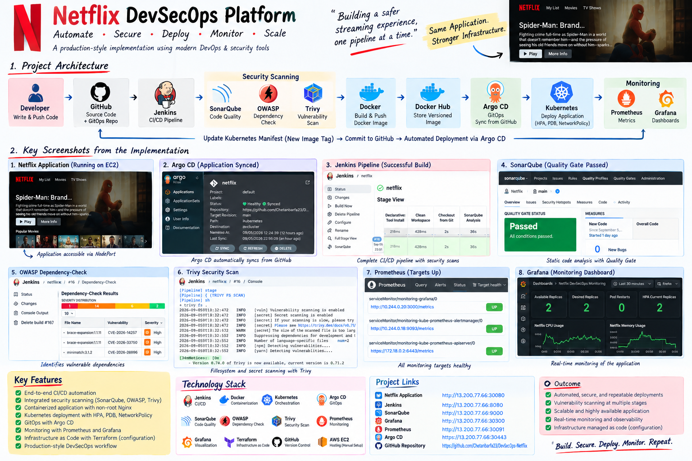
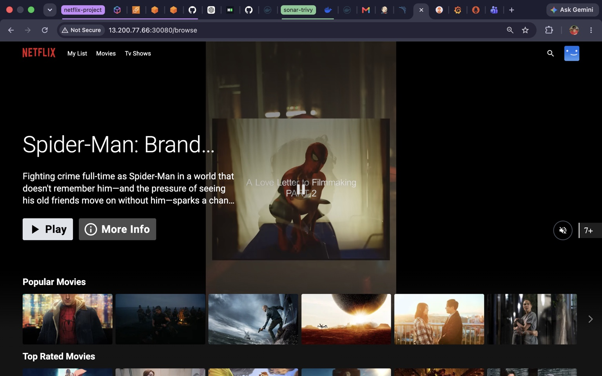
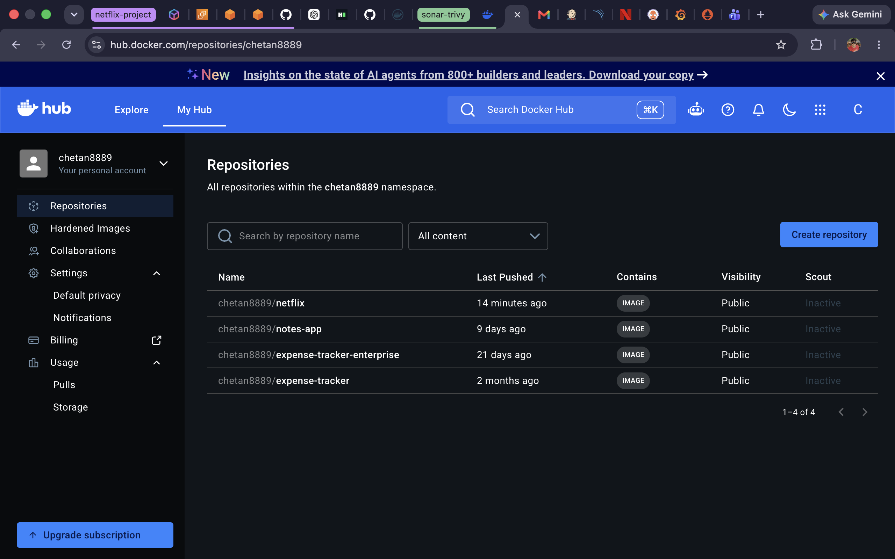
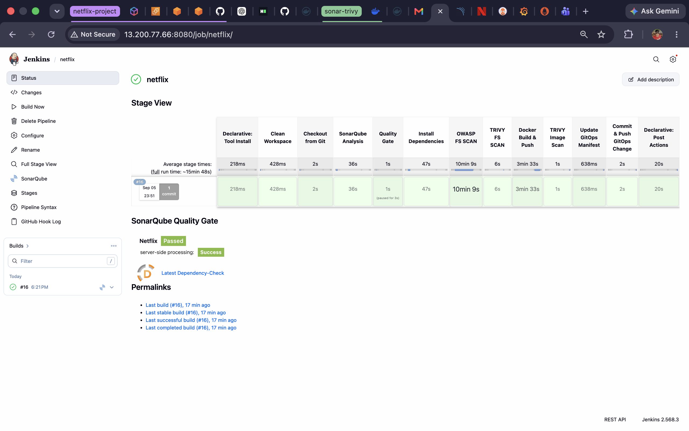
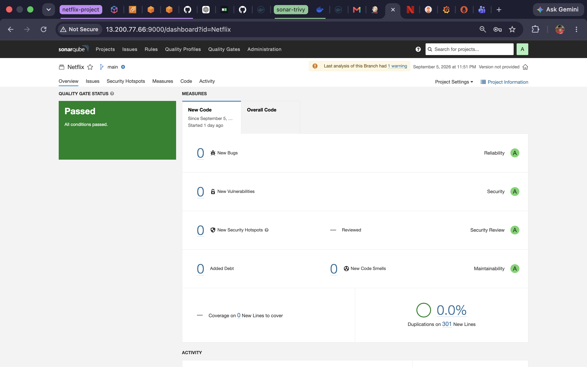
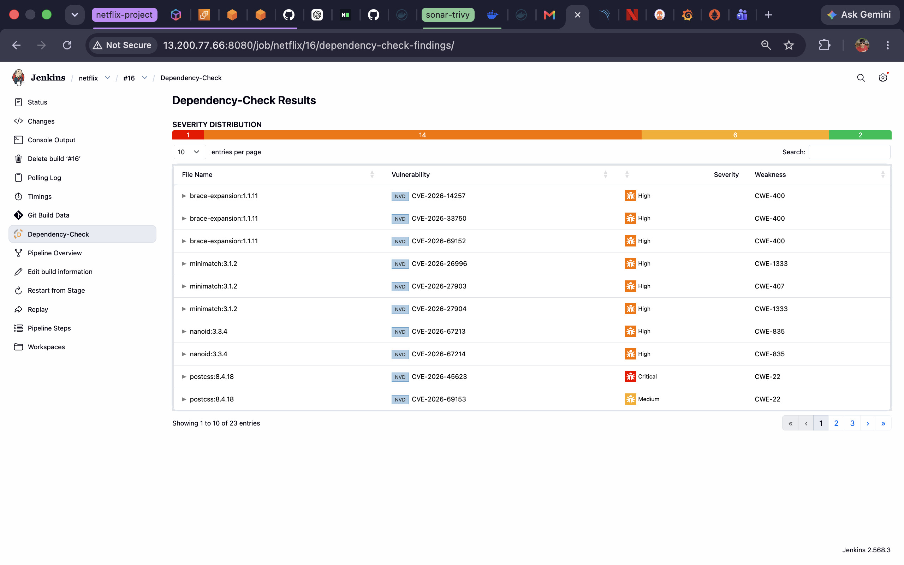
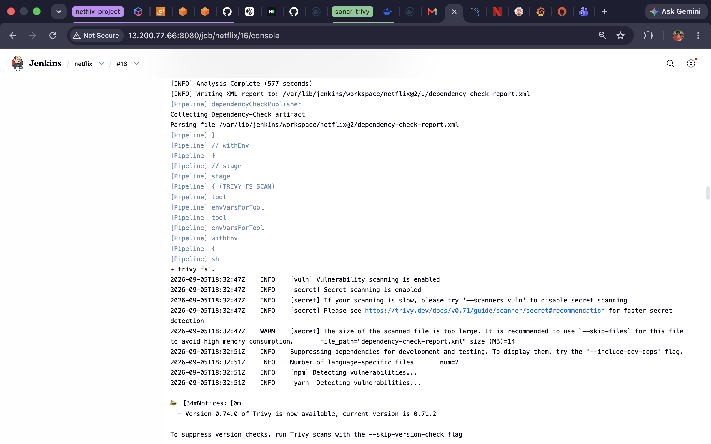
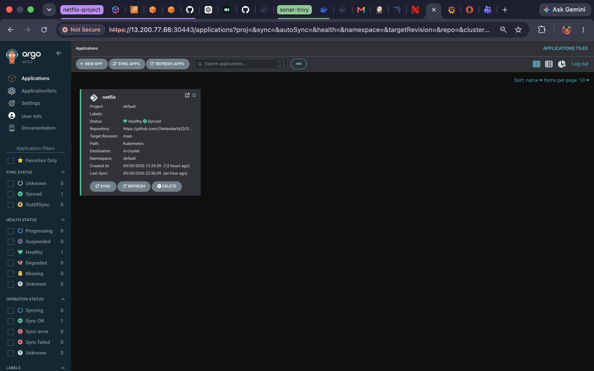
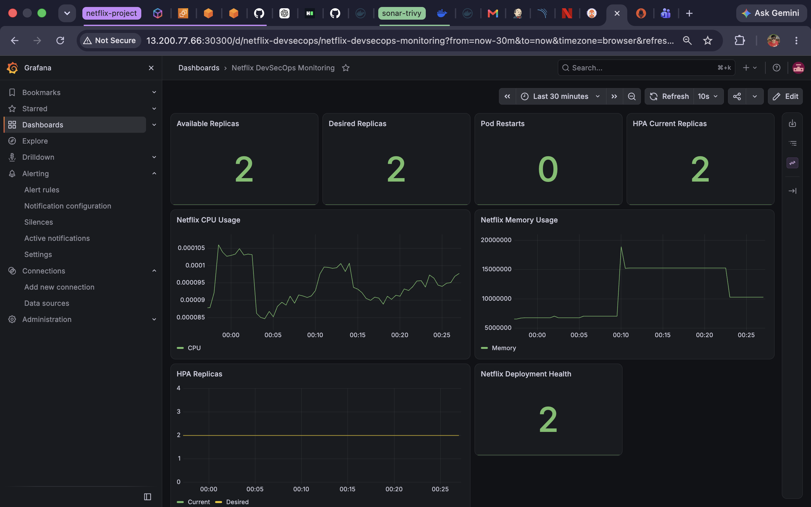
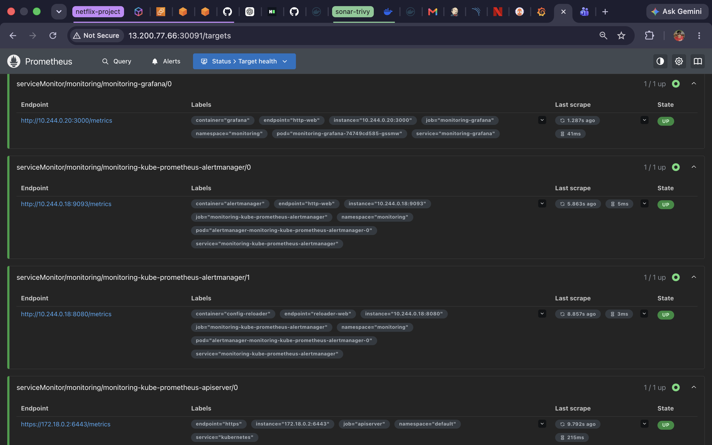

# Netflix DevSecOps Platform

A production-style DevSecOps implementation for a Netflix Clone application, built with automated CI/CD, security scanning, containerization, Kubernetes, GitOps, infrastructure configuration, monitoring, and alerting.

## About the Project

The Netflix Clone application is based on the open-source `N4si/DevSecOps-Project` as the application starting point.

The DevSecOps infrastructure, CI/CD workflow, containerization, Kubernetes deployment, GitOps integration, monitoring, alerting, recovery configuration, and related improvements in this repository were implemented as part of this project.

## DevSecOps Architecture

The diagram presents the complete DevSecOps workflow implemented in this project, from source code and automated CI/CD security validation to containerization, GitOps-based Kubernetes deployment, and continuous monitoring with Prometheus and Grafana.

## Project Evidence & Screenshots

The following screenshots demonstrate the major components and security stages of the DevSecOps implementation.

### Application

### GitHub Repository

### Jenkins CI/CD Pipeline

### SonarQube Code Quality & Security

### OWASP Dependency-Check

### Trivy Security Scan

### Argo CD GitOps Deployment

### Grafana Monitoring Dashboard

### Prometheus Target Monitoring

